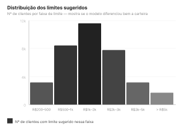

# 1. Descrição sobre a Microinterface
O gráfico mostra quantos clientes receberam cada faixa de limite depois que o algoritmo rodou. No eixo horizontal estão as faixas de valor, de R$200 até acima de R$5.000, e no eixo vertical está a quantidade de clientes em cada uma delas.
O que queremos ver aqui é se o modelo está diferenciando os clientes ou jogando todo mundo na mesma faixa. Uma distribuição espalhada, com pico no meio e barras menores nas extremidades, indica que o algoritmo separou bem os perfis, dando limites maiores para quem tem menos risco e menores para quem tem mais. Se aparecer uma única barra dominante com quase todos os clientes concentrados num mesmo valor, é sinal de que algo na calibragem não está certo.

# 2.Rascunhos
Para o Andamento desse gráfico foi utilizado a tecnologia P5.js, mas antes foi elaborado como ele ficaria por meio do figma que entrega como esperamos deixar ao final:

  
  
<em>Gráfico de Distribuição de Limite Sugerido</em>

